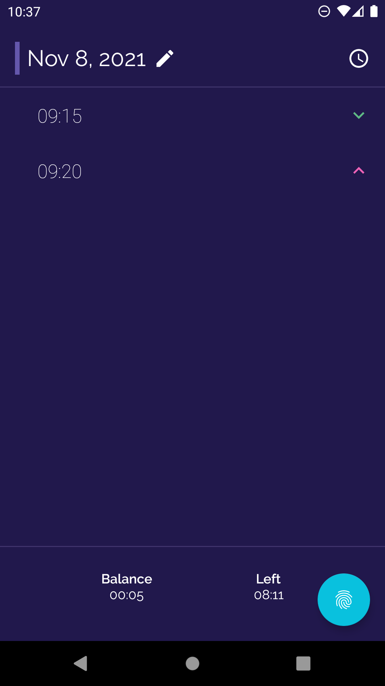
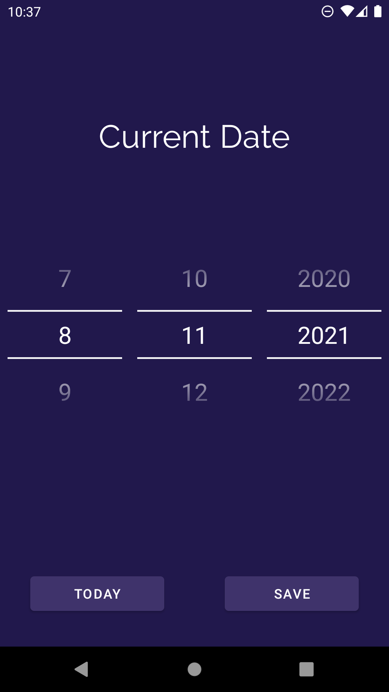
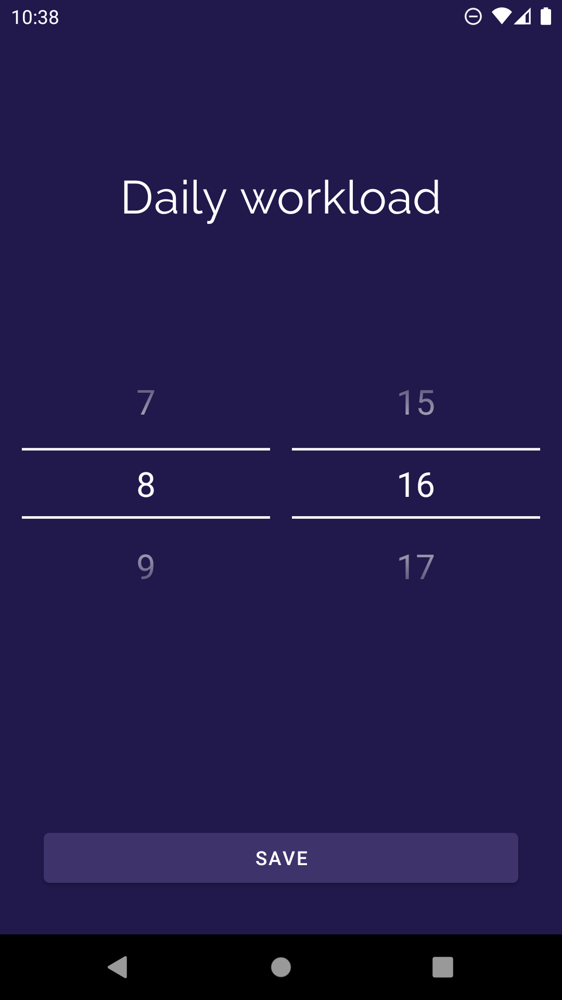
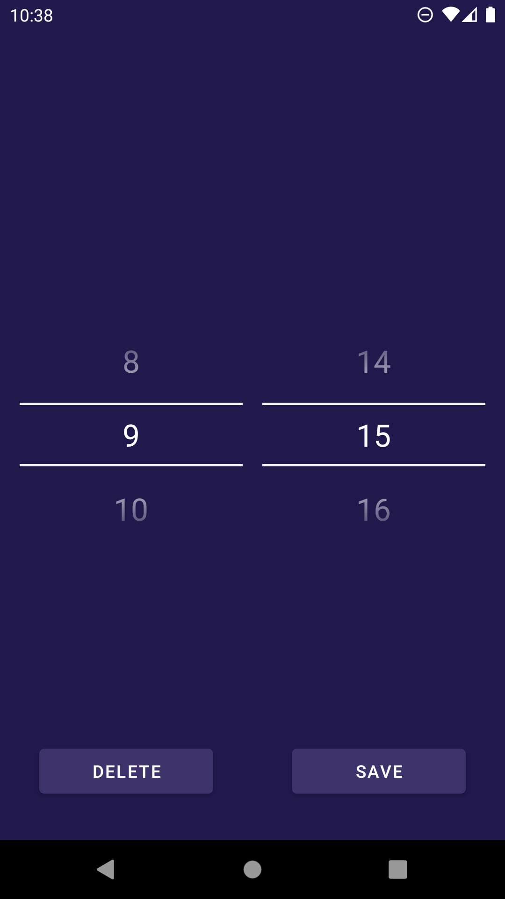

# Clucko

Simple android app to register clock ins and clock outs.

	
	
	
	

# Vide demo

[Watch demo on youtube](https://youtu.be/zfJPMUP24mk)

# Features

- add clock ins
- edit or delete clock ins
- change current display date
- change daily workload
